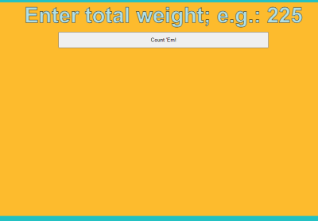
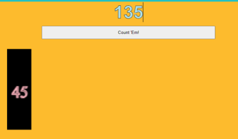
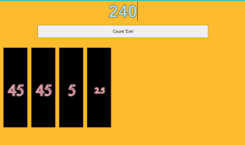
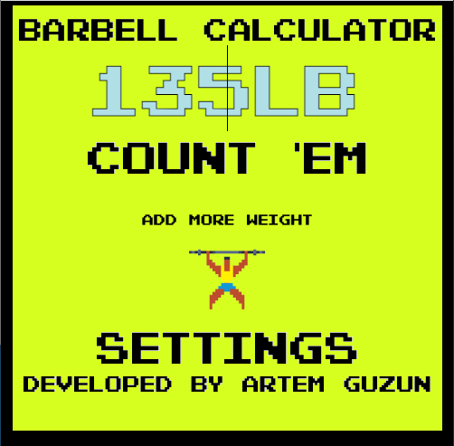

## Simple barbell weight calculator web app. 

Simplify your training by entering your training weight and let the calculator 
show you which weights are needed on each side to meet the target weight. 

### Created by Artiom Guzun
#### Made with HTML, CSS, Vanilla JS

#### Credits: 
#### Barbell Guy Sprite credits to Adobe Stock Images
#### Font: Pixel NES © (Neale Davidson)

##### To Do:
###### -Add settings menu to change which plates the user has.
###### -Add background effects 

### Version 1:

### Version 2

